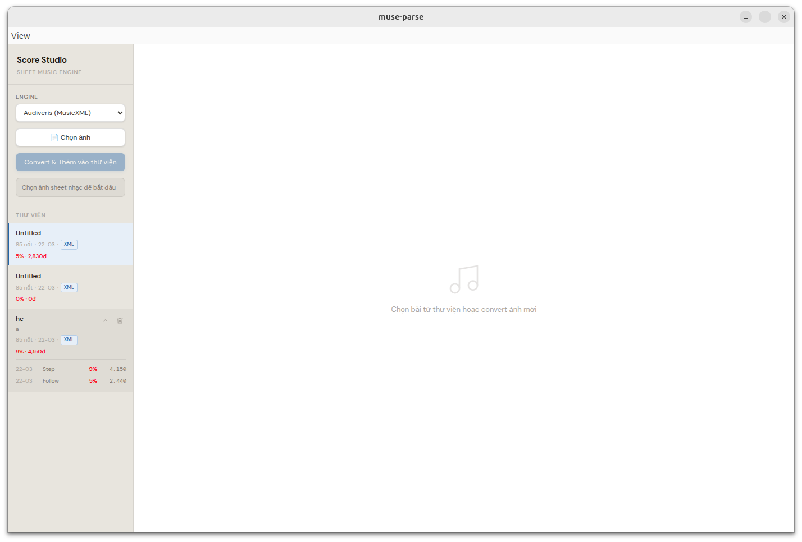
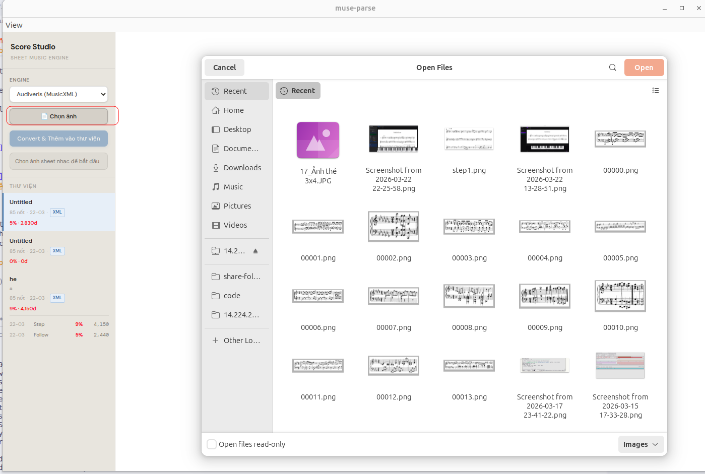
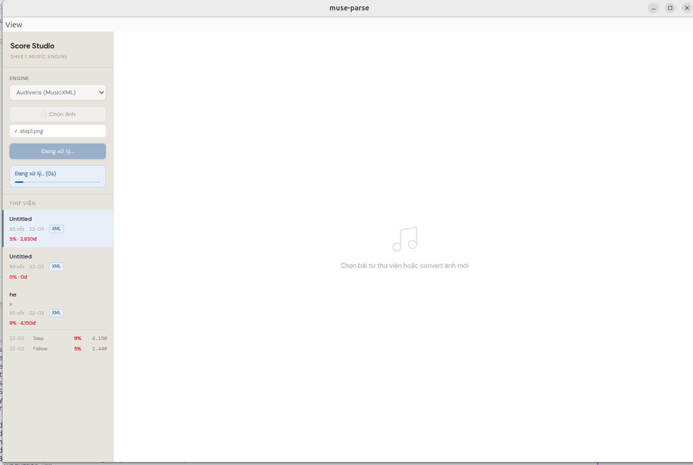
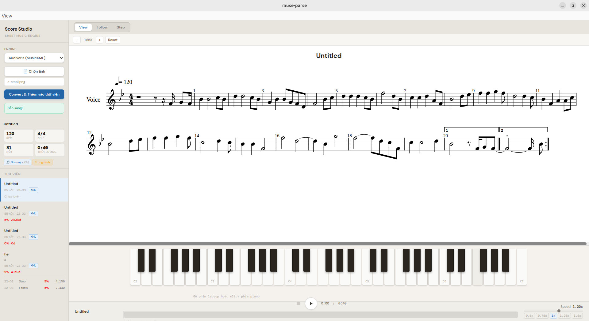
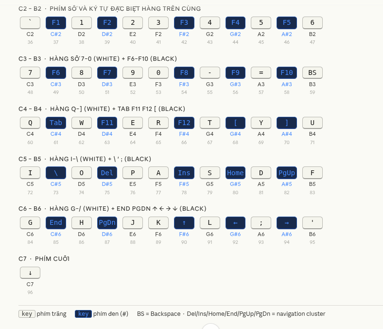
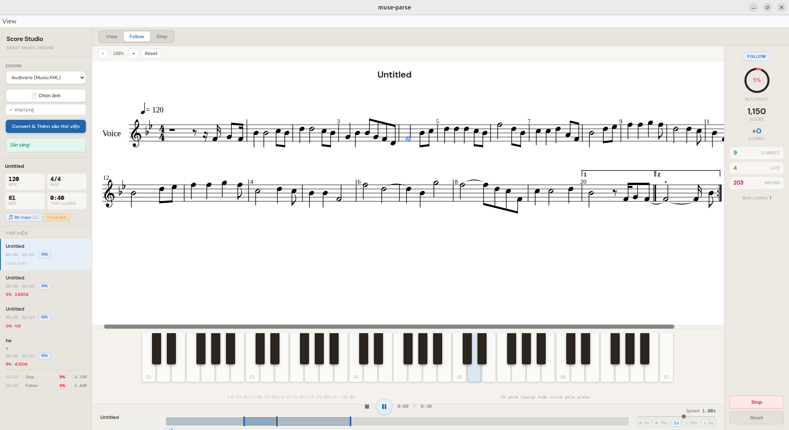
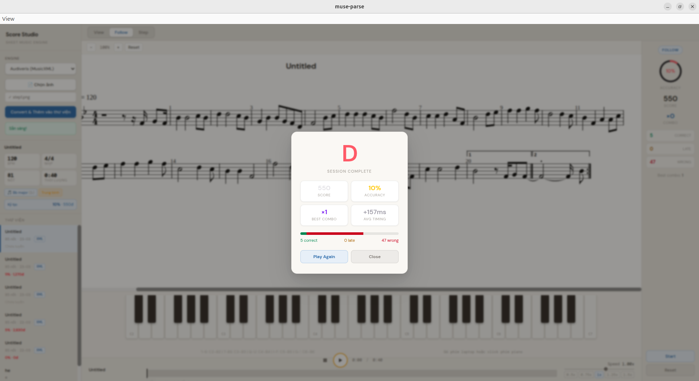
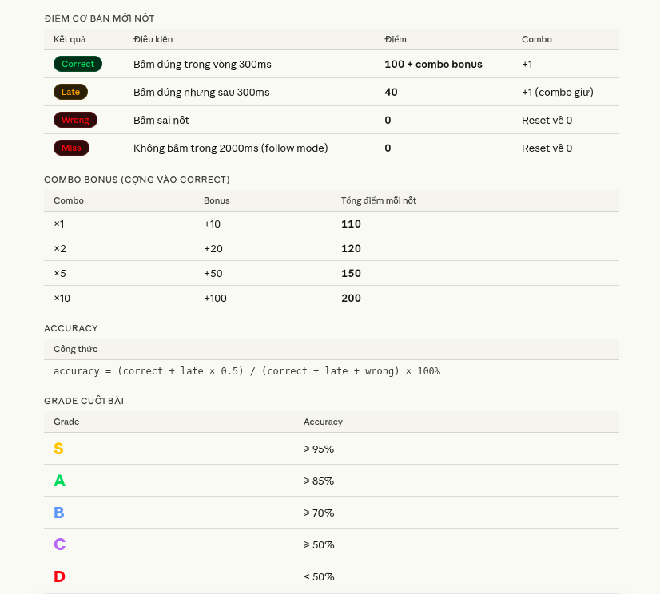

# Score Studio — Piano Learning System

Ứng dụng học piano tích hợp nhận diện bản nhạc (OMR). Chuyển đổi ảnh sheet nhạc thành MusicXML, phát nhạc và luyện tập với chấm điểm real-time.

**Stack:** Electron + React + TypeScript (Frontend) · Spring Boot (Backend, chạy trên WSL)

---

## Tính năng

- **Sheet Viewer** — render MusicXML bằng OpenSheetMusicDisplay, highlight note đang phát
- **Playback** — âm thanh soundfont piano, điều chỉnh tốc độ, loop đoạn bất kỳ
- **Practice Mode** — Follow (bấm theo nhạc chạy) và Step (nhạc dừng chờ bấm đúng)
- **Scoring** — chấm điểm correct / late / wrong theo timing, combo, grade S→D
- **Library** — lưu bài, lịch sử luyện tập, kỷ lục per bài (localStorage)
- **Piano keyboard** — 61 phím C2→C7, map toàn bộ bàn phím laptop

---

## I. Cài đặt Frontend (Windows)

### 1. Node.js

Nếu chưa có Node.js:

1. Tải [`install-node.bat`](https://github.com/Mr-1504/Score-Studio/releases/download/untagged-e55e68601fb5f3835d1c/install-node.bat)
2. Chuột phải → **Run as Administrator**

### 2. Chạy ứng dụng

Trên Windows, truy cập vào ổ `G\`, vào thư mục `doan/minh/Score-Studio` và chạy:

```bash
npm run dev
```

---

## II. Cài đặt Backend (WSL)

Backend Spring Boot chạy trong WSL để tương thích với các engine xử lý ảnh.

### 1. Mở WSL

```bash
# Trong PowerShell (Windows)
wsl
```

### 2. Khởi chạy server

```bash
cd /mnt/g/doan/minh/Muse-Parse
./gradlew bootRun
```

Server sẽ lắng nghe ở cổng `2104`.

---

## III. Hướng dẫn sử dụng

### Workflow cơ bản

```
1. Chọn ảnh sheet nhạc  →  2. Convert  →  3. Bài được thêm vào Thư viện
         ↓
4. Chọn mode: View / Follow / Step
         ↓
5. Bấm Play  →  luyện tập  →  xem kết quả
```

*Màn hình chính*


*Chọn ảnh sheet nhạc*


*Giao diện đang chuyển đổi*


*Banh nhạc hiển thị sau khi chuyển đổi thành công - View Mode*


### Các mode luyện tập

| Mode | Mô tả |
|---|---|
| **View** | Phát nhạc bình thường, không chấm điểm |
| **Follow** | Nhạc chạy liên tục, bấm đúng nốt trước khi bỏ lỡ (2s) |
| **Step** | Nhạc dừng sau mỗi nốt, chỉ chạy tiếp khi bấm đúng |

*Double click trên timeline để chọn đoạn cần lặp*


### Keyboard mapping (61 phím)



### Loop đoạn

- **Double-click** trên timeline để bắt đầu kéo chọn vùng loop
- Drag 2 handle để điều chỉnh
- Bấm nút loop (⟲) để bật/tắt
- Bấm **×** để xóa vùng loop



### Scoring

| Kết quả | Điều kiện | Điểm |
|---|---|---|
| **Correct** | Bấm đúng trong 300ms (Follow) / 3s (Step) | 100 + combo×10 |
| **Late** | Bấm đúng nhưng trễ | 40 |
| **Wrong** | Bấm sai nốt | 0, reset combo |
| **Miss** | Không bấm trong 2s (Follow only) | 0, reset combo |

Grade cuối: **S** ≥95% · **A** ≥85% · **B** ≥70% · **C** ≥50% · **D** <50%


*Cach tính điểm*

---

---

## IV. Troubleshooting

**Không connect được backend**
→ Kiểm tra `hostname -I` trong WSL, cập nhật lại `.env`
→ Đảm bảo WSL2 firewall cho phép cổng 2104

**Soundfont không load**
→ Kiểm tra kết nối internet (app fetch từ CDN lần đầu)
→ App sẽ fallback sang synth tổng hợp nếu không load được

**Sheet không hiển thị**
→ Đảm bảo file XML hợp lệ (Audiveris output)
→ Thử zoom reset về 100%

**Keyboard không nhận phím**
→ Click vào vùng piano để blur input đang focus
→ Tắt input method tiếng Việt (app dùng `event.code` nên không bị ảnh hưởng layout)